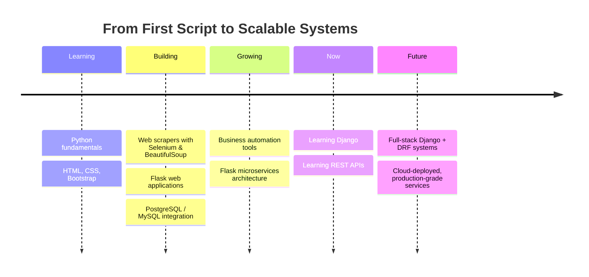

<div align="center">


<br/>


<br/><br/>

<a href="https://git.io/typing-svg">
  
</a>

<br/>


[](https://www.linkedin.com/in/ansari-mohammed-sameer-naseem)
[](mailto:sameeransarispidy4444@gmail.com)

</div>

<br/>

## 👋 About Me

```python
class Sameer:
    def __init__(self):
        self.role        = "Python Developer"
        self.focus       = ["Automation", "APIs", "Web Applications",
                             "Problem Solving", "Scalable Backend Systems"]
        self.building    = ["Business Automation Tools", "Flask Microservices"]
        self.learning    = ["Django", "REST APIs"]

    def philosophy(self):
        return "Write it once. Automate it forever."
```

I'm a **Python developer** who enjoys turning repetitive, manual work into clean, reliable, automated systems — from backend APIs to scraping pipelines to full web applications. I care about code that's practical, scalable, and actually ships.

<br/>

## ⚡ Tech Stack

<div align="center">

**Backend & Automation**


**Databases**


**Frontend**


</div>

<br/>

Prefer a rounded icon-grid look instead? Swap the badge rows above for this single line — it renders as clean animated-hover icon tiles:

```md

```

<br/>

## 📊 GitHub Analytics

<div align="center">


</div>

<br/>

## 🚀 Featured Projects

<table width="100%">
<tr>
<td width="50%" valign="top">

### 🔄 Business Automation Suite
Automates recurring business workflows — data entry, report generation, and scheduled scraping jobs — replacing hours of manual work with a single scheduled script.

`Python` `Selenium` `BeautifulSoup` `PostgreSQL`

[`View Repository →`](#)

</td>
<td width="50%" valign="top">

### 🧩 Flask Microservices Starter
A modular Flask-based microservice template with clean routing, PostgreSQL integration, and a structure built for scaling into multiple independent services.

`Flask` `Python` `PostgreSQL` `REST`

[`View Repository →`](#)

</td>
</tr>
<tr>
<td width="50%" valign="top">

### 🌐 Web Scraper & Data Pipeline
Collects and normalizes data from multiple web sources using Selenium and BeautifulSoup, then loads it into a structured MySQL database for analysis.

`Selenium` `BeautifulSoup` `Requests` `MySQL`

[`View Repository →`](#)

</td>
<td width="50%" valign="top">

### 🖥️ Client Web Application
A responsive, form-driven web application built with Flask, Bootstrap, and HTML/CSS — designed for real client use, not just a demo.

`Flask` `Bootstrap` `HTML` `CSS`

[`View Repository →`](#)

</td>
</tr>
</table>

> Replace the `#` links above with your actual repo URLs, and swap in your real project names/descriptions.

<br/>

## 🧭 Developer Journey



> GitHub renders Mermaid diagrams natively — this timeline displays as an actual interactive-looking chart, no image hosting required.

<br/>

## 🤝 Connect With Me

<div align="center">

<a href="https://www.linkedin.com/in/ansari-mohammed-sameer-naseem">
  
</a>
<a href="mailto:sameeransarispidy4444@gmail.com">
  
</a>

</div>

<br/>

<div align="center">


**Thanks for stopping by — let's build something scalable.**

</div>
